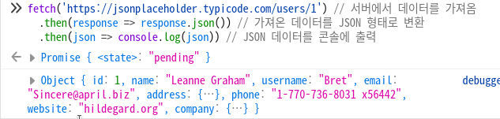

# 온보딩코스 웹기초

### 2/22

---

# 1. 웹서비스란?

---

---

# 2. 백엔드? 프론트엔드?

---

# 3. HTTP 요청과 응답

---

## HTTP 요청

- 주어진 리소스에 하고 싶은 동작
- 예: `GET`, `POST`, `PATCH`, `DELETE`

<!--
  CRUD: Create Read Update Delete
  PUT: 리소스를 대체

  https://developer.mozilla.org/en-US/docs/Web/HTTP/Methods
-->

---

### GET

리소스를 가져오기

```json
{ "사과": 1, "바나나": 2 }
```

- GET `/` -> `{ "사과": 1, "바나나": 2 }`
- GET `/사과` -> `{ "사과": 1 }`

---

### GET - 직접 해보자!

```ts
fetch('https://jsonplaceholder.typicode.com/users/1') // 서버에서 데이터 가져오기
  .then(response => response.json()) // json으로 변환
  .then(json => console.log(json)) // 콘솔에 출력
```

`F12` -> 콘솔에 붙여넣기

<!-- 또는 curl 'https://jsonplaceholder.typicode.com/comments/1' -->

---

### GET - 직접 해보자!



실행 결과

---

### POST

서버에 데이터를 보내기

```json
// 이전
{}
```

- POST `{ "바나나": 2 }` -> `{ "바나나": 2 }`

```json
// 이후
{ "바나나": 2 }
```

<!--
  https://developer.mozilla.org/ko/docs/Web/HTTP/Headers/Content-Type
-->

---

### PATCH

리소스 일부분을 수정하기

```json
// 이전
{ "바나나": 1 }
```

PATCH `{ "바나나": 2 }`

```json
// 이후
{ "바나나": 2 }
```

<!--
  https://developer.mozilla.org/ko/docs/Web/HTTP/Methods/PATCH
-->

---

### DELETE

지정한 리소스를 **삭제**하기

```json
// 이전
{ "바나나": 1 }
```

DELETE 바나나

```json
// 이후
{}
```

<!--
  https://developer.mozilla.org/ko/docs/Web/HTTP/Methods/DELETE
-->

---

# 동기와 비동기

---
