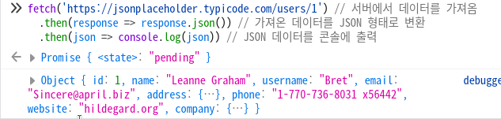

# 온보딩코스 웹기초

2/22

---


# 1. HTTP 요청과 응답

---

## 웹은 어떻게 동작할까?

![][client-server]

[client-server]: https://developer.mozilla.org/ko/docs/Learn/Getting_started_with_the_web/How_the_Web_works/client-server.jpg

<!-- https://developer.mozilla.org/ko/docs/Learn/Getting_started_with_the_web/How_the_Web_works -->

1. 브라우저가 DNS 서버에 가서 해당 IP 주소를 찾음
2. 해당 주소에 웹페이지 사본을 보내달라는 HTTP 요청을 보냄
3. 서버는 요청을 승인하고 `200 OK`응답과 패킷을 보냄
4. 브라우저는 받은 패킷을 웹사이트로 조합해 보여줌

<!--
HTTP: 웹 상에서 정보(주로 HTML)를 주고받는 통신 규약
HTML: 마크업 언어
DNS: Domain Name System -> 도메인 이름을 IP 주소로 바꿔주는 서비스
resolvectl --protocol=dns | grep 'DNS Servers'
DNS Servers: 192.168.1.1

dig +short google.com
172.217.161.238
 -->

---

### google.com에 접속할 때 일어나는 일들

```sh
curl --verbose google.com
```

```
*   Trying 172.217.161.238:80...
* Connected to google.com (172.217.161.238) port 80 (#0)
> GET / HTTP/1.1
> Host: google.com
> User-Agent: curl/7.85.0
> Accept: */*
>
* Mark bundle as not supporting multiuse
< HTTP/1.1 301 Moved Permanently
< Location: http://www.google.com/
< Content-Type: text/html; charset=UTF-8
< Date: Wed, 22 Feb 2023 00:27:17 GMT
< Expires: Fri, 24 Mar 2023 00:27:17 GMT
(...)
<HTML><HEAD><meta http-equiv="content-type" content="text/html;charset=utf-8">
<TITLE>301 Moved</TITLE></HEAD><BODY>
<H1>301 Moved</H1>
The document has moved
<A HREF="http://www.google.com/">here</A>.
</BODY></HTML>
```

---

```sh
curl --verbose www.google.com
```

```
* Connected to www.google.com (172.217.161.196) port 80 (#0)
> GET / HTTP/1.1
> Host: www.google.com
> User-Agent: curl/7.85.0
> Accept: */*
>
* Mark bundle as not supporting multiuse
< HTTP/1.1 200 OK
< Date: Wed, 22 Feb 2023 00:27:20 GMT
< Expires: -1
< Cache-Control: private, max-age=0
< Content-Type: text/html; charset=ISO-8859-1
(...)
<!doctype html>(...)
```

---

## HTTP 요청

- 주어진 리소스에 하고 싶은 동작
- 예: `GET`, `POST`, `PATCH`, `DELETE`

<!--
  CRUD: Create Read Update Delete
  PUT: 리소스를 대체

  https://developer.mozilla.org/en-US/docs/Web/HTTP/Methods
-->

---

### GET

리소스를 가져오기

```json
{ "사과": 1, "바나나": 2 }
```

- GET `/` -> `{ "사과": 1, "바나나": 2 }`
- GET `/사과` -> `{ "사과": 1 }`

---

### GET - 직접 해보자!

```ts
fetch('https://jsonplaceholder.typicode.com/users/1') // 서버에서 데이터 가져오기
  .then(response => response.json()) // json으로 변환
  .then(json => console.log(json)) // 콘솔에 출력
```

`F12` -> 콘솔에 붙여넣기

<!-- 또는 curl 'https://jsonplaceholder.typicode.com/comments/1' -->

---

### GET - 직접 해보자!



실행 결과

---

### POST

서버에 데이터를 보내기

```json
// 이전
{}
```

- POST `{ "바나나": 2 }` -> `{ "바나나": 2 }`

```json
// 이후
{ "바나나": 2 }
```

<!--
  https://developer.mozilla.org/ko/docs/Web/HTTP/Headers/Content-Type
-->

---

### PATCH

리소스 일부분을 수정하기

```json
// 이전
{ "바나나": 1 }
```

PATCH `{ "바나나": 2 }`

```json
// 이후
{ "바나나": 2 }
```

<!--
  https://developer.mozilla.org/ko/docs/Web/HTTP/Methods/PATCH
-->

---

### DELETE

지정한 리소스를 **삭제**하기

```json
// 이전
{ "바나나": 1 }
```

DELETE 바나나

```json
// 이후
{}
```

<!--
  https://developer.mozilla.org/ko/docs/Web/HTTP/Methods/DELETE
-->

---

## HTTP 응답

| 분류 |      설명       |
| :--: | :-------------: |
| 1xx  |      정보       |
| 2xx  |      성공       |
| 3xx  |   리다이렉션    |
| 4xx  | 클라이언트 오류 |
| 5xx  |    서버 오류    |

HTTP 요청이 성공적으로 끝났는지 알려줌

<!--
https://developer.mozilla.org/ko/docs/Web/HTTP/Status#정보_응답
https://dev.opera.com/articles/http-response-codes/
-->

---

### 2xx: 성공 응답

요청이 성공

| 상태        | 설명                             |
| :---------- | :------------------------------- |
| 200 OK      | 요청한 리소스나 행동 결과를 반환 |
| 201 Created | 새로 만들어진 리소스를 반환      |

 <!-- https://developer.mozilla.org/ko/docs/Web/HTTP/Status -->

---

### 3xx: 리다이렉트

다른 페이지로 이동

| 상태                   | 설명                        |
| :--------------------- | :-------------------------- |
| 301 Moved Permanently  | 영구 주소 변경              |
| 302 Found              | 임시 주소 변경              |
| 304 Not Modified       | 캐시 사용 (응답이 그대로임) |
| 307 Temporary Redirect | 임시 주소 변경              |
| 308 Permanent Redirect | 영구 주소 변경              |

<!--
301 vs 307: 307은 메소드/바디 변경을 허용하지 않음
302 vs 308: 308은 메소드/바디 변경을 허용하지 않음

304: F12 -> Network
-->

---

### 4xx: 클라이언트 오류

클라이언트의 요청이 잘못됨

| 상태                   | 설명                              |
| :--------------------- | :-------------------------------- |
| 400 Bad Request        | 잘못된 요청 (요청 문법 오류 등)   |
| 401 Unauthorized       | 인증이 필요함                     |
| 403 Forbidden          | 접근 금지 (인증이 된 상태)        |
| 404 Not Found          | 리소스를 찾을 수 없음             |
| 405 Method Not Allowed | 의도적으로 지원하지 않는 메소드   |
| 408 Request Timeout    | 요청 시간 초과                    |
| 418 I'm a teapot       | 찻주전자라서 커피 내리기를 거부   |
| 429 Too Many Requests  | 주어진 시간 동안 요청이 너무 많음 |

<!--
curl --verbose scarf005.github.io/foo --output /dev/null

https://developer.mozilla.org/en-US/docs/Web/HTTP/Status/400
-->

---

### 5xx: 서버 오류

서버에 문제가 있음 (자주 보면 좋지 않음)

| 상태                      | 설명                                            |
| :------------------------ | :---------------------------------------------- |
| 500 Internal Server Error | 서버가 처리 방법을 모름                         |
| 501 Not Implemented       | 서버가 메소드를 지원 못함                       |
| 502 Bad Gateway           | 게이트웨이가 서버에서 올바르지 않은 응답을 받음 |
| 503 Service Unavailable   | 서버가 일시적으로 사용 불가                     |
| 504 Gateway Timeout       | 게이트웨이가 응답 시간 초과                     |

<!--
게이트웨이: 트래픽을 중계하는 컴퓨터/소프트웨어
https://developer.mozilla.org/ko/docs/Web/HTTP/Status/502
https://ko.wikipedia.org/wiki/게이트웨이
https://www.reddit.com/r/explainlikeimfive/comments/j5us8/eli5_what_502_and_504_errors_are_please/
-->


---


# 2. 웹서비스란?

---

## 웹서비스

- API의 한 종류
- 네트워크에서 컴퓨터들끼리 상호작용하기 위한 서비스
- 웹 서버를 부를 때 쓰기도 함

```sh
curl https://jsonplaceholder.typicode.com/users/1
```

<!--
  웹서비스가 하는 일: 주로 XML, HTTP와 같은 프로토콜로 JSON이나 XML같은 정보를 주고받음
  API: 소프트웨어가 다른 소프트웨어와 상호작용하기 위한 인터페이스

  https://www.w3.org/TR/2004/NOTE-ws-gloss-20040211/#webservice
  https://ko.wikipedia.org/wiki/웹_서비스
  https://www.reddit.com/r/explainlikeimfive/comments/2o5o5j/eli5_web_services/
  https://stackoverflow.com/questions/2205788/is-there-a-difference-between-a-web-server-and-a-web-service
-->

---

### 웹 서버

| 구분       | 하는 일                       |
| ---------- | ----------------------------- |
| 소프트웨어 | HTTP 요청 -> HTML 문서        |
| 하드웨어   | 위 프로그램이 돌아가는 컴퓨터 |

<!--
  https://ko.wikipedia.org/wiki/웹_서버
-->

---

## 웹의 세계

|           웹페이지            |       웹사이트        |
| :---------------------------: | :-------------------: |
| https://dummyjson.com/todos/1 | https://dummyjson.com |

<!--
웹페이지: 웹사이트에서 하나의 문서
웹사이트: 웹페이지들의 모음
 -->

---

|    웹서버    |  검색엔진   |  브라우저   |
| :----------: | :---------: | :---------: |
| ![][express] | ![][google] | ![][chrome] |

[express]: https://upload.wikimedia.org/wikipedia/commons/6/64/Expressjs.png
[google]: https://upload.wikimedia.org/wikipedia/commons/2/2f/Google_2015_logo.svg
[chrome]: https://upload.wikimedia.org/wikipedia/commons/e/e1/Google_Chrome_icon_(February_2022).svg

<!--

웹페이지, 웹사이트, 웹서버, 검색엔진

https://developer.mozilla.org/ko/docs/Learn/Common_questions/Web_mechanics/Pages_sites_servers_and_search_engines

-->

---

## URL 알아보기

http://www.example.com:80/path/to/myfile.html?key1=value1&key2=value2#SomewhereInTheDocument

프로토콜: `http`
도메인: `www.example.com`
포트: `80`
자원에 대한 경로: `/path/to/myfile.html`
추가 파라미터: `?key1=value1&key2=value2`
anchor(닻): `SomewhereInTheDocument`

<!--
프로토콜: `http`, `mailto`, `ftp`
도메인: `www.example.com`, `127.0.0.1`
포트: `80`(http), `443`(https)
자원에 대한 경로: `/path/to/myfile.html`
추가 파라미터: `?`로 시작, `&`로 구분, `{key}={value}` 형태
anchor(닻): 절대로 서버에 전송되지 않음

https://developer.mozilla.org/ko/docs/Learn/Common_questions/Web_mechanics/What_is_a_URL
-->


---


# 프론트엔드? 백엔드?

---

## 프론트엔드

- 보통은 클라이언트에서
- 서버가 가져온 데이터를 화면에 보여주는 역할
- 언어: HTML, CSS, JS

## 백엔드

- 보통은 서버에서
- 프론트엔드에게 데이터를 제공하는 역할
- 언어: 자유, 보통은 Java, Python, Ruby, PHP, Node.js, Go
- DB, 서버, 네트워크 등의 기술을 사용

<!-- https://en.wikipedia.org/wiki/Frontend_and_backend -->

---

## 프론트엔드와 백엔드를 나누는 이유

![신 오브젝트][god]

[god]: https://www.researchgate.net/profile/William-Grosky/publication/307572331/figure/fig1/AS:792593864597508@1565980511623/An-example-of-god-object-Web-service.png

- 동시에 개발이 가능하다
- 같은 일을 하는 부분끼리 따로 나누었기 때문에 유지보수하기 좋다
- API로만 통신하므로 서로의 구현에 영향을 받지 않는다

<!--
https://ko.wikipedia.org/wiki/관심사_분리
-->


---

---
marp: true
style: |
  .columns {
    display: grid;
    grid-template-columns: repeat(2, minmax(0, 1fr));
    gap: 1rem;
  }
---

# 동기와 비동기

---

## 동기의 예시

<div class="columns">
<div>


</div>
<div>

손님이 주문을 하고 주방에서 음식이 나올때까지 기다림
(주방은 한 번에 10개까지 음식을 만들 수 있음)

| 손님 수 | 걸리는 시간 |
| ------- | ----------- |
| 1       | 6분         |
| 2       | 12분        |
| 10      | 1시간       |
| 20      | 2시간       |

</div>
</div>

---

### 비동기의 예시

<div class="columns">
<div>

</div>
<div>

손님은 주문표만 뽑고, 주방에서 음식이 나오면 그때 받으러 감

| 손님 수 | 걸리는 시간 |
| ------- | ----------- |
| 1       | 6분         |
| 2       | 6분         |
| 10      | 6분         |
| 20      | 12분        |

</div>
</div>

---

## 비동기란


- 작업이 끝날 때까지 기다리지 않는 것
- 예시: 이메일 (전화와 달리 바로 답변할 필요 없음)
- fetch, db 통신등은 시간이 오래 걸리는 작업이므로 비동기로 처리하는 것이 좋음
<!--
https://developer.mozilla.org/ko/docs/Glossary/aSynchronous
https://developer.mozilla.org/ko/docs/Learn/JavaScript/Asynchronous
-->

---

### 비동기 직접 써보기

```ts
const response = fetch('https://jsonplaceholder.typicode.com/users/1') // 서버에서 데이터 가져오기
console.log(response) // Promise { <state>: "fulfilled", <value>: Response }

const jsonPromise = response.then(response => response.json()) // json으로 변환
console.log(jsonPromise) // Promise { <state>: "fulfilled", <value>: Response }

jsonPromise.then(json => console.log(json)) // 결과값 출력
```

---

### Promise란

- 나중에 결과를 반환할 거라고 약속(promise)하는 객체
- `then`: 나중에 결과가 나오면 실행할 함수를 등록
- `catch`: 나중에 실패한다면 실행할 함수를 등록

```ts
const 나중에3 = new Promise((resolve, reject) => resolve(3))
const 나중에실패 = new Promise((resolve, reject) => reject('실패'))

나중에3.then(결과 => console.log(결과)) // 3
나중에실패.catch(이유 => console.log(이유)) // 실패
```

---

### js에서 비동기

지정한 밀리초 이후 함수를 실행

```ts
console.log('1')
setTimeout(() => console.log('3'), 500)
console.log('2')
// 숫자는 실제 실행 순서
```

---

### 어떻게 동작하는 걸까?

- stack에 있는 코드는 순차 실행
- setTimeout같이 비동기 코드는 순차실행이 불가능하니 실행을 미루고 대기실로 이동
- 대기가 끝난 코드들은 (예시: 500밀리초 기다리기 끝!) 큐로 이동
- 스택이 비어있으면 큐에서 코드를 가져와 실행

<!-- 참고: https://youtu.be/v67LloZ1ieI?t=244 -->

---

### async와 await

promise를 쉽게 쓰기 위한 문법 설탕

```ts
function getPromise(): Promise<number> {
  return new Promise(resolve => resolve(1))
}

function fetchDataThen() {
  const promise: Promise<number> = getPromise()
  promise.then((data: number) => console.log(data))
}
fetchDataThen()
```

---

### async await 사용시

```ts
async function getPromiseAsync(): Promise<number> {
  return 1
}

async function fetchDataAsync() {
  const data: number = await getPromiseAsync()

  console.log(data)
}
fetchDataAsync()
```

`async` 키워드: 함수가 무조건 Promise를 반환하게 만듬
`await` 키워드: Promise가 끝날 때까지 기다림

<!--
https://ko.javascript.info/async-await
 -->

